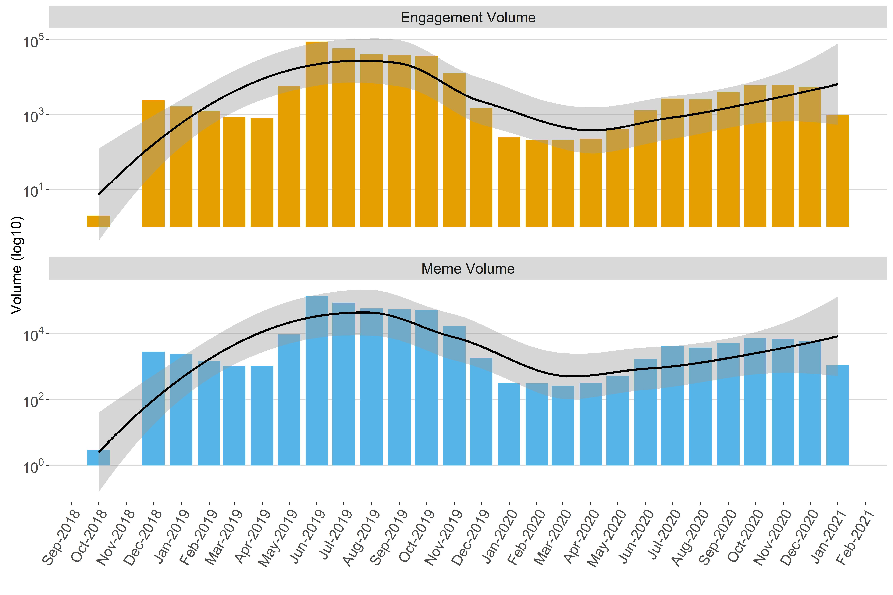
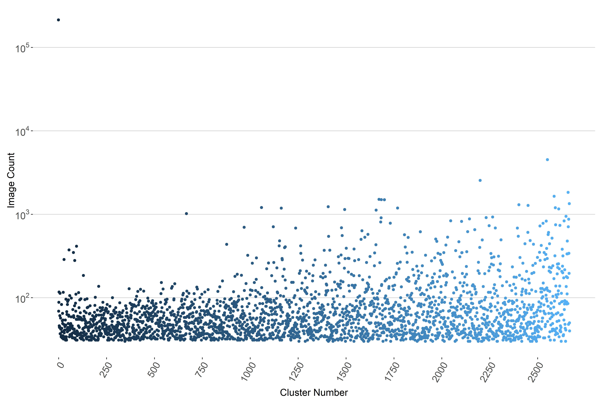
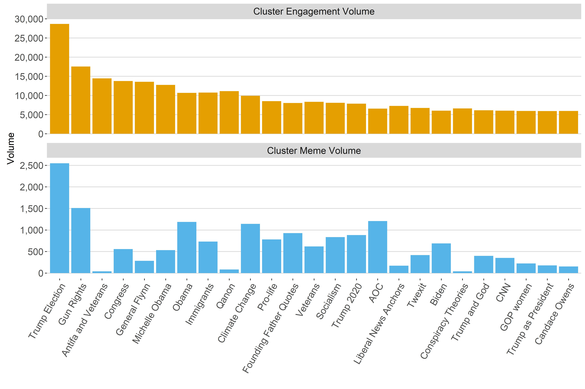
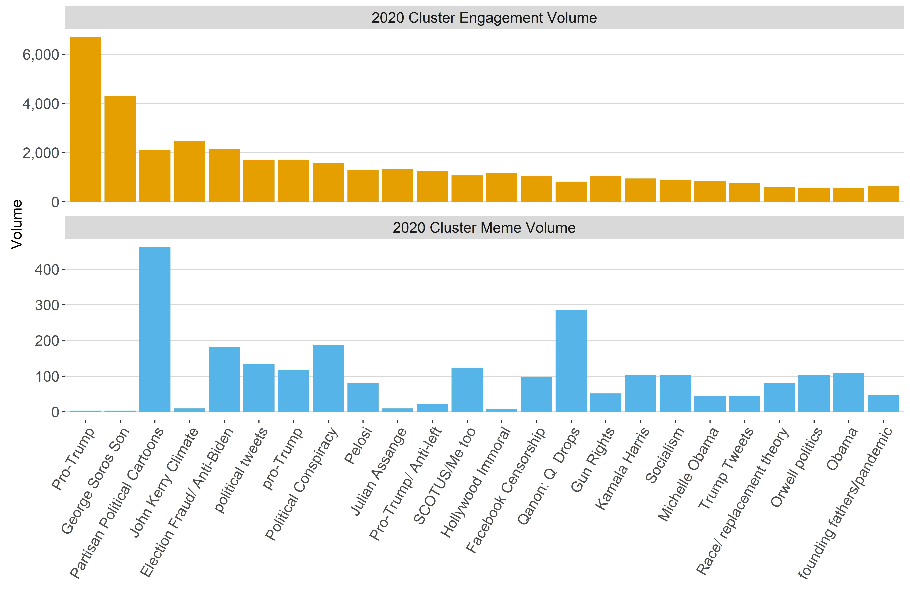
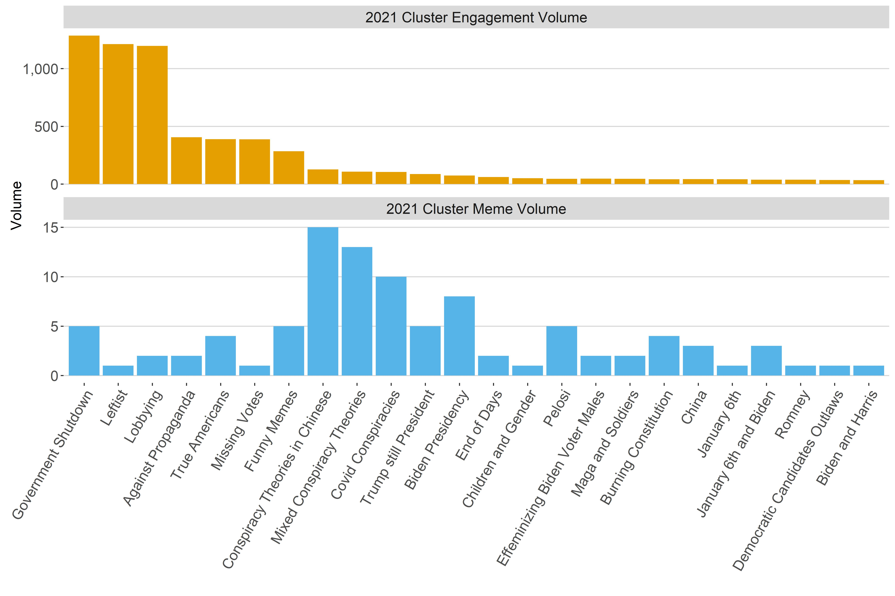
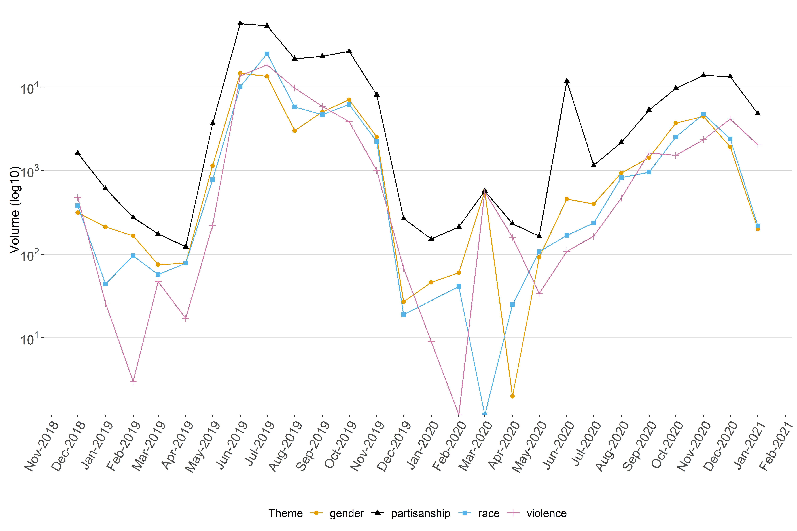
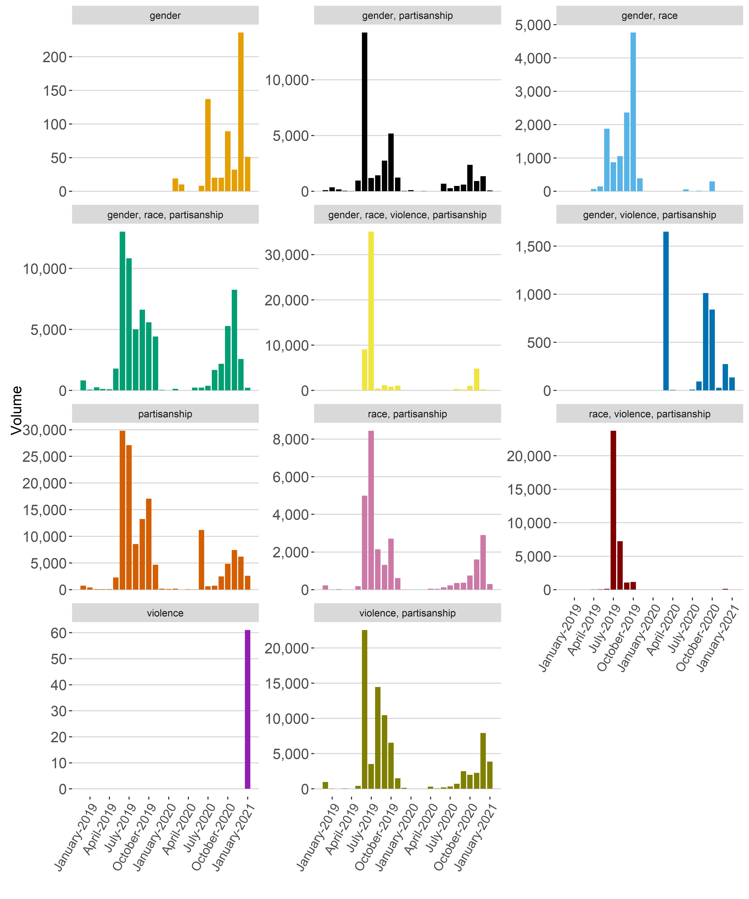
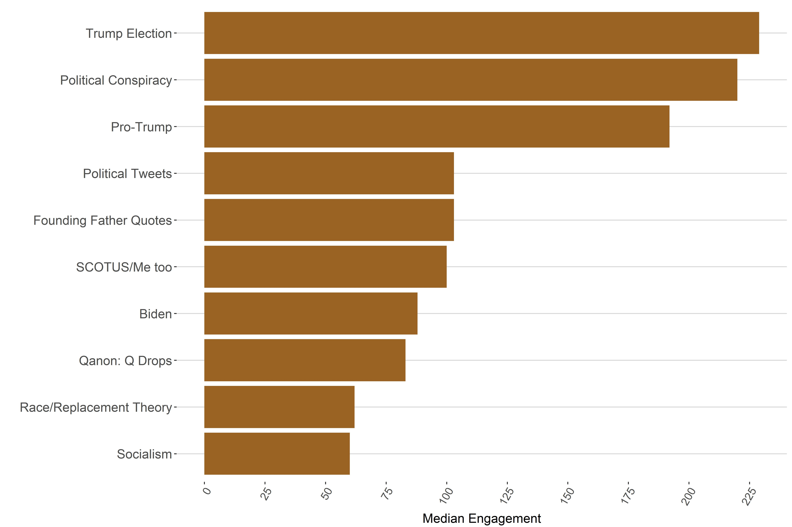
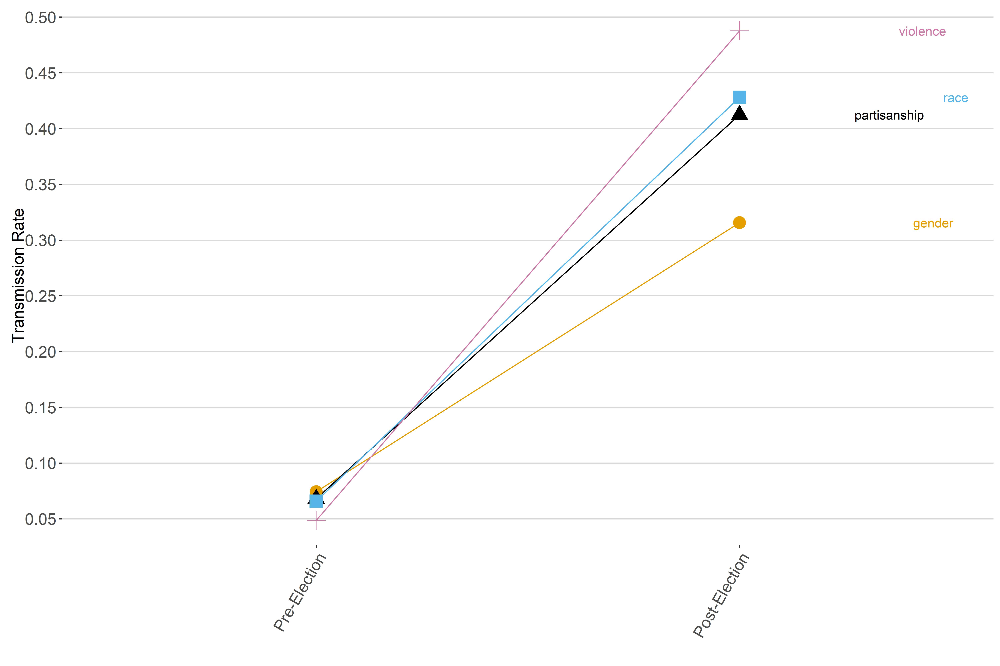

data-visualization
================
adl
2023-02-03

### Supplementary Code for: GNET Year 3 Report

#### Authors: Ayse D. Lokmanoglu, PhD; Mowafak Allaham; Rod M. Abhari; Chloe Morterson; and Esteban Villa-Turek

Install the packages and libraries needed.

## Figure 3: Monthly Volume of Memes and Engagement with the Memes

- Load the data file

- Create labels

- Plot the graph
  <!-- -->

*Delete the variables*

``` r
rm(list = ls())
```

## Figure 4: Distribution of image counts per cluster

- Load the data file

- Plot the data
  <!-- -->

## Figure 5: Top 25 Clusters Engagement and Meme Volume

- Load the data file

- Create labels

<!-- -->

## Figure 6: Top 25 Most Engaged Clusters in 2020

- Load the data file

- Create labels

-Plot graph
<!-- -->

## Figure 7: Top 25 Most Engaged Clusters in January 2021

- Load the data file

- Create labels

- Plot the graph
  <!-- -->

## Figure 8: Aggregate Monthly Engagement for Themes

- Load the data file

- Plot graph
  <!-- -->

## Figure 9: Monthly Aggregate Engagement by Intersectional Themes

- Load data

- Plot graph
  <!-- -->

## Figure 12: Top 10 Memes by Monthly Median Engagement

- Load data

- Plot graph
  <!-- -->

## Figure 13: Meme Transition Rates Pre- and Post-Election

- Load data

- Reorder the data, and create a column to label line graphs

- Plot graph
  <!-- -->
